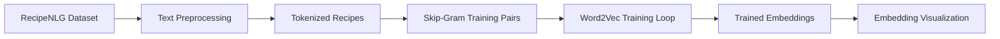
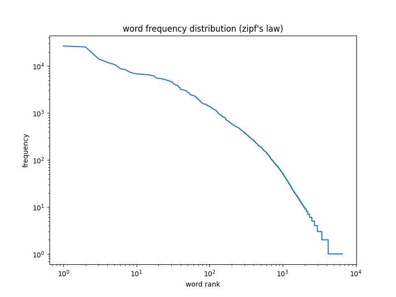
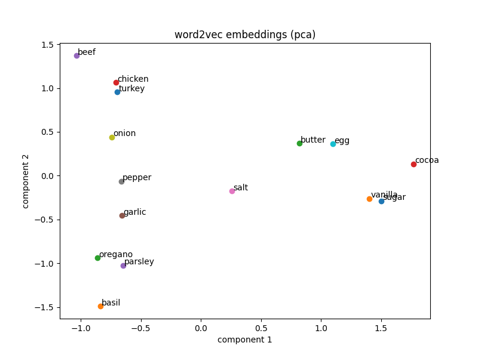
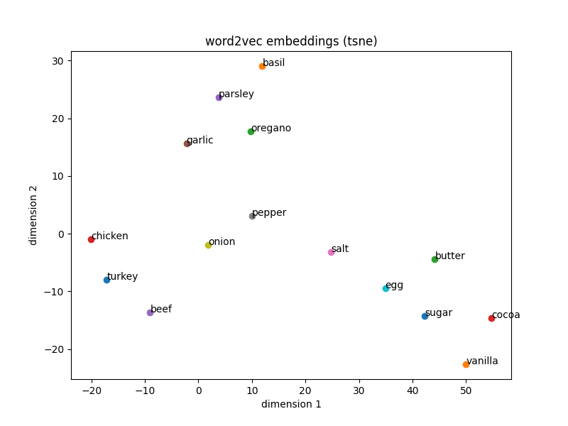

# Word2Vec Skip-Gram (NumPy Implementation)


---

## Overview

This repository implements the **core training loop of Word2Vec using pure NumPy**.  
No deep learning frameworks such as PyTorch or TensorFlow are used.

The project focuses on implementing the full **optimization procedure**, including:

- forward pass
- loss computation
- gradient calculation
- parameter updates with stochastic gradient descent

The model follows the **Skip-Gram with Negative Sampling** approach and is trained on a subset of the **RecipeNLG dataset**.

The goal is to demonstrate a clear understanding of how word embeddings are learned from text through context prediction.

---

## Logic

The training pipeline follows these steps:

1. Load and preprocess recipe text
2. Build the vocabulary and map each word to an index
3. Generate Skip-Gram training pairs from tokenized sentences
4. Initialize input and output embedding matrices
5. Compute prediction scores using dot products
6. Apply the negative sampling loss
7. Compute gradients and update parameters using SGD
8. Save trained embeddings and visualize the results

---

## System Flow


---

## Word Frequency Distribution

The dataset follows **Zipf's Law**, where a small number of words appear very frequently while most words appear rarely.



This long-tail distribution is typical for natural language data and explains why techniques such as **negative sampling** are useful for efficient Word2Vec training.

---

## Word Embedding Visualization

The learned embeddings can be visualized using dimensionality reduction.

### PCA projection



### t-SNE projection



These visualizations show that semantically related ingredients cluster together in the embedding space.

---

## Skip-Gram Training Example

The figure below illustrates how a center word predicts nearby context words during training.


Example sentence:
garlic chicken pasta olive oil


Generated training pairs:
pasta → garlic
pasta → chicken
pasta → olive
pasta → oil


This process is repeated across the dataset to learn meaningful word embeddings.

---

## Project Summary

| Part | Description |
|:-----|:-------------|
| **Part 1: Data Processing** | Cleaned and tokenized RecipeNLG text to create training data |
| **Part 2: Training Pair Generation** | Built Skip-Gram training pairs using a sliding context window |
| **Part 3: Word2Vec Training Loop** | Implemented forward pass, negative sampling loss, gradients, and SGD updates using NumPy |
| **Part 4: Embedding Analysis** | Retrieved nearest neighbors and visualized embeddings with PCA and t-SNE |

---

## Project Structure

See the full directory layout here: [Project Structure](project_structure.txt)

---

## Training Loop Reference

For a quick reference of the **core Word2Vec training implementation**, see: [Implementation](models/train_word2vec.py)

## How to Run

### Step 1: Show available commands

```bash
make help
```
### Step 2: Prepare the dataset

This cleans the raw recipe text and generates tokenized sentences.

```bash
make prepare_data
```
### Step 3: Generate training pairs

Build the vocabulary and create Skip-Gram training pairs.

```bash
make build_pairs
```
### Step 4: Train the Word2Vec model
This runs the full training loop using NumPy.

```bash
make train_model
```
### Step 5: Inspect learned embeddings

Print nearest neighbors for selected words.

```bash
make inspect_embeddings
```
### Step 6: Create embedding visualizations

Generate PCA and t-SNE projections.

```bash
make plot_embeddings
```
### Step 7: Plot word frequency distribution

Visualize Zipf's law in the dataset.

```bash
make plot_word_frequency
```
### Step 8: Generate the Skip-Gram training diagram

```bash
make visualize_training_diagram
```